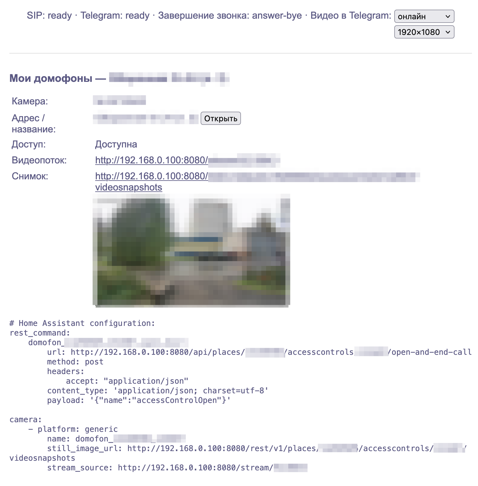

# domru
Форк [moleus/domru](https://github.com/moleus/domru)

Прокси к API Дом.ру с веб-интерфейсом и уведомлениями о звонке в домофон.

- Камеры своего и соседних подъездов(соседние только при наличии платной подписки дом.ру), кнопка «Открыть», готовые сниппеты для
  Home Assistant.
- **Звонок в домофон → сообщение в Telegram с фотографией гостя и кнопкой
  «Открыть дверь».** Нажатие открывает дверь и гасит вызов на панели.
- Вслед за фото — видео 30 секунд (15 до начала звонка и 15 после)
- Webhook о звонке для Home Assistant и своих сценариев.



## Установка

Готовых образов нет, образ собирается из исходников. Нужен Docker.

### Минимум: прокси и веб-интерфейс

```bash
git clone https://github.com/niklzz/domru && cd domru
mkdir data
docker build -t domru:local .
docker run -d --name domru --restart unless-stopped -p 8080:18000 \
  -v "$PWD/data:/data" -e DOMRU_CREDENTIALS=/data/accounts.json domru:local
```

Откройте `http://<хост>:8080/` и войдите: телефон и код из SMS либо логин и пароль.
Токены сохранятся в `data/accounts.json`, дальше прокси обновляет их сам.

### Дополнительно: оповещения в Telegram с кнопкой "Открыть дверь"

1. Создайте бота у `@BotFather`. Напишите ему `/start` или добавьте в группу и
   возьмите числовой `chat.id` из `https://api.telegram.org/bot<токен>/getUpdates`
   (у групп он отрицательный). Бот должен быть отдельным: с настроенным webhook
   он не запустится.
2. Создайте `.env` рядом с `docker-compose.sip.yml`:

   ```dotenv
   DOMRU_SIP_IP=192.168.1.10        # адрес этого хоста в локальной сети
   DOMRU_SIP_END_MODE=answer-bye    # кнопка открывает дверь и гасит панель
   DOMRU_TELEGRAM_BOT_TOKEN=123456:ABC...
   DOMRU_TELEGRAM_CHAT_ID=-1001234567890
   DOMRU_TELEGRAM_VIDEO=true        # видео к каждому звонку; потом переключается на главной
   ```

3. Замените контейнер (данные в `data/` остаются):

   ```bash
   docker rm -f domru
   docker compose -f docker-compose.sip.yml up -d --build
   ```

4. Проверьте `http://<хост>:8080/api/integrations/state`: `sip` и `telegram` должны
   быть `ready`. Та же строка видна под шапкой главной. Позвоните с панели — придёт
   фото с кнопкой.

Домофон определяется сам, если у аккаунта он один. Несколько квартир или дверей —
задайте нужную в `.env`: `DOMRU_SIP_PLACE_ID` и `DOMRU_SIP_ACCESS_CONTROL_ID` (оба
числа есть в ссылке на снимок у карточки на главной, кандидаты перечислены в логе).

Compose работает в `network_mode: host`: SIP-серверу оператора нужен прямой
UDP-доступ к порту `5060` и диапазону `20000–20100`. Запускайте одну копию: вторая
SIP-регистрация или второй поллер бота ломают обе. Обновление — `git pull` и снова
`up -d --build`.

## Что происходит при звонке

1. Гость нажимает кнопку на панели. Прокси зарегистрирован на домофоне как ещё одна
   трубка, получает `INVITE` и отвечает `180 Ringing` — приложению Дом.ру это не
   мешает.
2. В Telegram уходит фото 1920×1080 из потока камеры с кнопкой «Открыть дверь». Если
   снимок не удался за 6 с — текст «Снимок недоступен» с той же кнопкой.
3. Нажатие открывает дверь и завершает звонок в режиме `DOMRU_SIP_END_MODE`. При
   `answer-bye` панель замолкает сразу, а не через 25–30 с таймаута.
4. Через ~20 с ответом на фото приходит видео: 15 с до звонка и 15 с после.
5. Если задан `DOMRU_WEBHOOK_URL`, туда уходит `POST {"event":"Ringing"}`.

Кнопка бессрочная: работает после перезапуска и всегда относится к своему звонку —
старая кнопка из истории чата откроет дверь, но не завершит новый вызов.

**Платная подписка Дом.ру для видео не нужна.** Источник ролика выбирается на
главной странице, в строке статуса рядом с SIP и Telegram: **выкл**, **архив** или
**онлайн**. Архив — облачная запись оператора (`/video?TS=`) в 1080p; пункт доступен
только при подписке с записью (прокси проверяет это пробным запросом при старте и
при выборе). Онлайн — **live-буфер**: постоянное соединение с потоком камеры и
последние 20 с кадров в памяти, поэтому секунды до звонка тоже попадают в ролик.
Для онлайна там же выбирается поток: 1920×1080 (~1.4 Мбит/с, ~15 ГБ в сутки) или
960×528 (~0.45 Мбит/с, ~4 ГБ). Выбор хранится в `video-settings.json` рядом с
`accounts.json`; `DOMRU_TELEGRAM_VIDEO` — только начальное значение. Если архив
перестал отдавать запись (подписка закончилась), прокси сам переключается на онлайн.
На диск видео не пишется, FLV ремуксится в MP4 в памяти, без ffmpeg. Подписка нужна
только для просмотра камер соседних подъездов на главной.

## Настройки

Любой параметр — переменная `DOMRU_ИМЯ`; базовые доступны и флагами
(`--port`, `--credentials`, `--log-level`, `--refresh-token`, `--operator-id`).

| Переменная | По умолчанию | Смысл |
|---|---|---|
| `DOMRU_PORT` | `18000` | Порт HTTP |
| `DOMRU_CREDENTIALS` | `/share/domofon/accounts.json` | Файл токенов; в его каталоге лежат и файлы состояния |
| `DOMRU_LOG_LEVEL` | `info` | `debug` / `info` / `warn` / `error` |
| `DOMRU_REFRESH_TOKEN`, `DOMRU_OPERATOR_ID` | — | Начальные учётные данные, только парой; при старте перезаписывают `accounts.json` |
| `DOMRU_SIP_ENABLED` | `false` | Регистрировать SIP-клиент (в `docker-compose.sip.yml` уже `true`) |
| `DOMRU_SIP_IP` | — | IPv4 хоста в LAN, до которого доходит SIP-сервер оператора |
| `DOMRU_SIP_PORT` | `5060` | Локальный UDP-порт SIP |
| `DOMRU_SIP_RTP_FIRST`, `DOMRU_SIP_RTP_LAST` | `20000`, `20100` | UDP-диапазон приёма RTP; звук отбрасывается |
| `DOMRU_SIP_PLACE_ID`, `DOMRU_SIP_ACCESS_CONTROL_ID` | автоопределение | Домофон. Без них берётся единственный домофон аккаунта; задавать только оба |
| `DOMRU_SIP_END_MODE` | `off` | Что делать со звонком при открытии двери, см. ниже |
| `DOMRU_SIP_DIAGNOSTICS`, `DOMRU_SIP_DIAGNOSTICS_TOKEN` | `false`, — | Отладочные `POST /api/sip/calls/{id}/{reject\|answer-bye}` за Bearer-токеном от 24 символов |
| `DOMRU_TELEGRAM_BOT_TOKEN`, `DOMRU_TELEGRAM_CHAT_ID` | — | Бот и числовой ID личного чата или группы |
| `DOMRU_TELEGRAM_VIDEO` | `false` | Начальный источник ролика: `true` — архив (без записи — онлайн); `buffer` — онлайн; `false` — выкл. Дальше переключается на главной |
| `DOMRU_WEBHOOK_URL` | — | `http`/`https` адрес для `POST {"event":"Ringing"}` |

**Режим завершения звонка.** `off` — только открыть дверь, панель звонит до таймаута.
`reject` — открыть и ответить `486`: завершает только нашу ветку, панель звонит
дальше. `answer-bye` — ответить `200`/`ACK`, открыть, послать `BYE`: единственный
режим, который гасит панель, проверен на живом домофоне. По умолчанию `off`, потому
что молча гасить звонок, который слышат другие трубки, не стоит без явного согласия.

**Когда стартуют интеграции.** Если `DOMRU_SIP_ENABLED` выключен и Telegram не
задан, ничего не запускается. Иначе прокси ждёт первого входа на `/login`,
определяет домофон (повтор каждые 30 с) и поднимает SIP, Telegram и webhook. Причина
ожидания видна в `/api/integrations/state`.

**Файлы состояния** в каталоге `DOMRU_CREDENTIALS`: `accounts.json` (токены),
`sip-installation-id` (постоянный ID SIP-устройства), `telegram-state.json`
(привязки кнопок к звонкам, offset, результаты нажатий). Пишутся атомарно, права
`0600`. Держите каталог на постоянном томе, иначе старые кнопки перестанут работать.

## Webhook

`POST` на `DOMRU_WEBHOOK_URL`, тело `{"event":"Ringing"}`, заголовок
`Idempotency-Key: <ID звонка>`. До трёх попыток, повтор только на `429` и `5xx`.
Последняя ошибка — в `webhook_error` статуса.

```yaml
# Home Assistant; DOMRU_WEBHOOK_URL=http://homeassistant:8123/api/webhook/domru-ring
automation:
  - alias: Intercom ringing
    trigger:
      - platform: webhook
        webhook_id: domru-ring
        allowed_methods: [POST]
        local_only: true
    action:
      - service: notify.mobile_app_phone
        data:
          message: Звонок в домофон
```

## Веб-интерфейс и Home Assistant

Главная показывает карточки камер в трёх секциях: **Мои домофоны** (кнопка «Открыть»
только здесь и только при `allowOpen` из `/accesscontrols`), **Соседний подъезд**
(из `screen-sections`, смотреть можно с подпиской Pro) и **Другие камеры**. Камеры
сопоставляются по ID, а не по порядку; если дополнительные эндпоинты недоступны,
базовый список всё равно рендерится.

На каждой карточке — ссылка на поток `/stream/{cameraId}`, снимок и сниппет Home
Assistant: `rest_command` для открытия и `camera: platform: generic` с
`still_image_url`/`stream_source`. Сниппеты разных карточек сливайте под общими
ключами. Для домофона, за которым следит SIP, кнопка и `rest_command` идут через
`open-and-end-call` — дверь открывается и звонок завершается, как из Telegram.

Под шапкой — строка статуса интеграций, обновляется раз в 10 с и скрыта, когда они
выключены.

## HTTP API

| Маршрут | Метод | Что делает |
|---|---|---|
| `/` | GET | `301` на `/pages/home.html` |
| `/pages/home.html` | GET | Главная; без токена — `303` на `/login` |
| `/login` | GET, POST | Форма входа; POST телефона → список адресов |
| `/login/address` | GET | Выбор адреса, запрос SMS |
| `/sms` | POST | Код из SMS |
| `/loginWithPassword` | POST | Вход по логину и паролю |
| `/stream/{cameraId}` | GET | `302` на URL потока |
| `/api/integrations/state` | GET | Статус SIP, Telegram, webhook, режим завершения. Без авторизации и секретов |
| `/api/places/{placeId}/accesscontrols/{accessControlId}/open-and-end-call` | POST | Открыть домофон и завершить текущий звонок; без звонка просто открывает. Только для отслеживаемого домофона (`404`), только same-origin (`403`), таймаут 20 с |
| `/api/sip/calls/{callId}/reject`, `…/answer-bye` | POST | Диагностика, `Authorization: Bearer <token>` |
| остальное | любой | Проксируется в API Дом.ру с подстановкой токена |

Ответ `open-and-end-call`: `opening` — `accepted` (API принял команду, это не
датчик двери), `unknown` (сетевая ошибка после отправки, повтора не будет),
`failed`, `busy` (уже идёт открытие, HTTP `409`); `call` — `off`, `ended`, `absent`,
`failed`, `not_attempted`. HTTP `200` при `accepted`, `409` при `busy`, иначе `502`.

`/api/integrations/state`:

```json
{
  "sip":      {"state": "ready", "calls": [{"id": "…", "state": "ringing", "started": "…"}]},
  "telegram": {"state": "ready"},
  "webhook_error": "",
  "end_mode": "answer-bye"
}
```

Состояния SIP: `off`, `waiting_auth`, `registering`, `ready`, `error`; Telegram:
`off`, `starting`, `ready`, `error`. Поле `error` появляется только при ошибке и не
содержит токенов и URL.

Полезные эндпоинты Дом.ру, проксируемые как есть:

| Эндпоинт | Метод | Описание |
|---|---|---|
| `/rest/v1/subscriberplaces` | GET | Адреса |
| `/rest/v1/places/{placeId}/accesscontrols` | GET | Свои домофоны с `allowOpen` |
| `/rest/v1/places/{placeId}/screen-sections` | GET | Секции камер и доступ по подписке |
| `/rest/v1/places/{placeId}/accesscontrols/{id}/actions` | POST | Открыть дверь: `{"name":"accessControlOpen"}` |
| `/rest/v1/places/{placeId}/accesscontrols/{id}/snapshots` | GET | Миниатюра 500×281; `width`/`height` только апскейлят |
| `/rest/v1/forpost/cameras` | GET | Список камер |
| `/rest/v1/forpost/cameras/{cameraId}/snapshots?width=1920&height=1080` | GET | Кадр из потока в нативном разрешении |
| `/rest/v1/forpost/cameras/{cameraId}/video` | GET | URL потока; `?TS=<unix>` — архив, если есть запись |
| `/rest/v1/places/{placeId}/events?allowExtentedActions=true` | GET | События |
| `/rest/v1/subscribers/profiles`, `…/profiles/finances` | GET | Профиль, баланс |
| `/auth/v2/session/refresh` | GET | Обновление токена |

## Разработка

Go 1.22, шаблоны через `go:embed`, статический бинарник.

```bash
gofmt -l . && go vet ./... && go test ./...
go test -race ./...
CGO_ENABLED=0 go build -trimpath -ldflags="-s -w" -o domru .
```

- `pkg/sipclient` — SIP на [sipgo](https://github.com/emiago/sipgo) v0.28: REGISTER
  с Digest, `180` на INVITE, `486` по таймауту, `200 → ACK → BYE` с recvonly G.711.
  Ретрансмиты INVITE дедуплицируются — на звонок одно событие.
- `pkg/callcontrol` — единственная точка открытия двери: режимы завершения,
  `TryLock` без очереди, старый ID звонка никогда не завершает новый.
- `pkg/telegram` — long polling, фото/видео, бессрочные кнопки, состояние на диске.
- `pkg/webhook`, `pkg/videoclip` (архив, live-буфер, ремукс FLV→MP4 через
  `yapingcat/gomedia`), `pkg/authorizedhttp` (Bearer, повтор после 401),
  `pkg/atomicfile`.

Грабли sipgo: обработчик INVITE обязан блокироваться на всё время звонка, иначе
`CANCEL` получает `481`, а отложенный `486` не уходит; `ServeUDP` добавляет
слушатель асинхронно — старт ждёт появления соединения; глобальный zerolog
глушится, чтобы SIP-реквизиты не попали в лог.

Схема ядра прокси (без интеграций): 

Ошибки и предложения — в [issues](https://github.com/niklzz/domru/issues).
Лицензия — [MIT](LICENSE).
